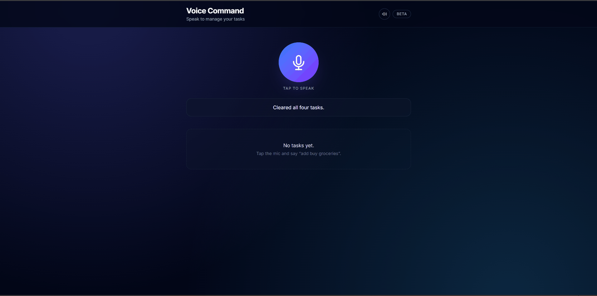

# Voice Command

A voice-controlled task manager where you speak naturally and an LLM routes your intent to typed API calls — no hardcoded phrase matching.



## What it does

Tap the mic, say what you want, and the app transcribes your speech, asks the backend to interpret it, and executes the right task operation. The status bar and text-to-speech reply use the same human-friendly message.

**Core operations**

| Say something like… | What happens |
|---------------------|--------------|
| "add buy groceries" | Creates a task |
| "show my tasks" | Lists tasks |
| "rename task 1 to call mom" | Renames a task |
| "mark task 2 as done" | Toggles done state |
| "replace task 1 with …" | Replaces a task |
| "delete task 2" | Deletes a task |

**Smart features**

- **Multi-task in one utterance** — "add milk, eggs, and call mom" creates three tasks in one go.
- **Fuzzy targeting** — "mark the groceries one as done" resolves by title substring when you do not give a number.
- **Priority from speech** — "add buy milk, it's urgent" sets high priority; low-priority phrasing sets low.
- **Undo** — "undo" or "undo that" reverses the last mutating action.
- **Bulk operations** — "clear all done tasks", "delete everything", "mark all as done".
- **Spoken queries** — "how many tasks do I have?" answers from the list without changing it.
- **Conversational speak-back** — the app reads its reply aloud after each command (mute toggle in the header).

Off-topic or unclear input returns a friendly hint instead of mutating tasks.

## Architecture

The system uses an **intent-routing pattern**: the LLM reasons over natural language and returns structured JSON; typed application code validates and executes it. There is no brittle if/else intent matching in the frontend or backend.

```
Microphone → Web Speech API → POST /instruction → Groq (Llama 3.1 8B)
  → {endpoint, method, params} or {actions: [...]}
  → Frontend dispatcher → /tasks CRUD → refreshed task list + spoken reply
```

- **Backend** — FastAPI, in-memory store, Pydantic v2 validation, deterministic title cleaner on create/update.
- **LLM layer** — `LLMProvider` Protocol with a `GroqAdapter` implementation (swappable without touching routers).
- **Frontend** — React hooks orchestrate recognition, dispatch, undo, bulk ops, and TTS.
- **Gateway** — Groq Llama 3.1 8B via the [4Geeks LiteLLM gateway](https://llm.4geeks.ai); API key stays server-side in `.env`.

## Tech stack

| Layer | Technology | Version |
|-------|------------|---------|
| API | FastAPI | 0.136.3 |
| Server | Uvicorn | 0.49.0 |
| Validation | Pydantic | 2.13.4 |
| HTTP client | httpx | 0.28.1 |
| Tests | pytest | 9.0.3 |
| UI | React | 19.2.6 |
| Build | Vite | 8.0.12 |
| Language | TypeScript | 6.0.2 |
| Styling | Tailwind CSS | 4.3.0 |
| LLM | Groq Llama 3.1 8B | via 4Geeks gateway |

## Running locally

### Prerequisites

- Python 3.11+
- Node 20+
- Chrome or Edge (Web Speech API for voice input)
- A 4Geeks LiteLLM API key

### Backend

```powershell
cd backend
python -m venv .venv
.\.venv\Scripts\Activate.ps1
pip install -r requirements.txt
Copy-Item .env.example .env
# Edit .env and set LLM_API_KEY — never commit this file
uvicorn app.main:app --reload
```

API: `http://127.0.0.1:8000` — interactive docs at `/docs`.

### Frontend

```powershell
cd frontend
npm install
Copy-Item .env.example .env
# Default VITE_API_BASE_URL=http://localhost:8000
npm run dev
```

App: `http://localhost:5173`

Restart the backend for a clean task list before recording a demo.

## API

### Task CRUD — `/tasks`

| Method | Path | Purpose |
|--------|------|---------|
| GET | `/tasks` | List all tasks |
| POST | `/tasks` | Create (`title`, optional `done`, optional `priority`) |
| PUT | `/tasks/{id}` | Replace task |
| PATCH | `/tasks/{id}` | Partial update (title and/or done) |
| DELETE | `/tasks/{id}` | Delete task |

### Intent routing — `POST /instruction`

Body: `{"transcription": "<voice text>"}`

Response is either a **single routing object**:

```json
{"endpoint": "/tasks", "method": "POST", "params": {"title": "buy milk", "done": false}}
```

or an **array of routing objects** when the LLM detects multiple distinct actions:

```json
[
  {"endpoint": "/tasks", "method": "POST", "params": {"title": "milk", "done": false}},
  {"endpoint": "/tasks", "method": "POST", "params": {"title": "eggs", "done": false}}
]
```

Allowed `(endpoint, method)` pairs: GET/POST on `/tasks`; PUT/PATCH/DELETE on `/tasks/{id}`. Item routes may use `params.id` (numeric) or `params.match` (title substring). Special `params.command` values handle undo, bulk clear, and spoken queries without hitting task endpoints directly.

Errors and unclear intents return `{"endpoint": null, "method": null, "params": {"error": "..."}}` with HTTP 200 so the frontend can show a friendly message.

## Testing

From `backend/` (with the virtual environment active):

```powershell
pytest -v
```

The suite currently has **34 tests** covering health, task CRUD, instruction routing (including multi-action responses), title normalization, and priority round-trips.

Frontend:

```powershell
cd frontend
npm run build
npm run lint
```

## Known limitations

- **In-memory storage** — tasks reset when the backend restarts; persistence is out of scope per the project brief.
- **Chromium-only voice** — Firefox and Safari lack the Web Speech API; those browsers show a disabled mic with an explanatory message.
- **LLM variability** — routing quality depends on few-shot prompt coverage; a server-side title cleaner catches verb leakage the model misses.
- **Single-level undo** — only the most recent mutating action can be reversed; re-created tasks get a new id.
- **No authentication** — local demo scope only.

## Project layout

```
backend/          FastAPI app, LLM adapter, pytest suite
frontend/         React + Vite UI
docs/             Demo GIF (docs/demo.gif)
PROGRESS.md       Build log and feature notes
```

See `backend/README.md` and `frontend/README.md` for per-package setup details.
